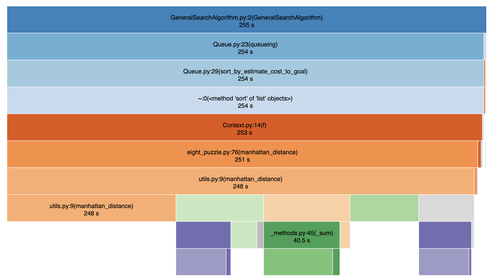

# eight-puzzle

## Introduce

**dependencies**

1. Numpy: use ndarray to represent state of eight puzzle
2. PyInquirer: use this module to constructe command line interface

**preparation**

> pip install -r ./requirements.txt

**execution**

>python eight_puzzle.py

## Performance

Instead of computing distances while sorting, I put distances in nodes to reduce computation.

Here is the current performance.(recording time drags the speed slightly)

Below is the performance before improvment.

## Examples

According to the performance of your computer, Uniform Cost Search will time out between depth 10 and 15.